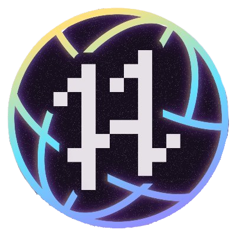

    

<h1 align="center"> Hacktoberfest 2022 🎉</h1>

🗣 Hacktoberfest encourages participation in the open source community, which grows bigger every year. Complete the 2022 challenge and earn a limited edition T-shirt.

📢 **Register [here](https://hacktoberfest.digitalocean.com) for Hacktoberfest and make four pull requests (PRs) between October 1st-31st to grab free SWAGS 🔥.**

---

## Github Contribution Rules
- Pull requests can be submitted to any opted-in repository on GitHub or GitLab.
- The pull request must contain commits you made yourself.
- If a maintainer reports your pull request as spam, it will not be counted toward your participation in Hacktoberfest.
- If a maintainer reports behavior that’s not in line with the project’s code of conduct, you will be ineligible to participate.
- To get a shirt, you must make four approved pull requests (PRs) on opted-in projects between October 1-31 in any time zone.
---

Steps for making a PR on this repository
* Fork this repo
* Go to [webpages](webpages) directory
* Create a sub-directory with your name
* Make a web page using any tech stack (eg. HTML, CSS, JS)
* Make pull request

Head over to [CONTRIBUTING.md](CONTRIBUTING.md) for a comprehensive guide!